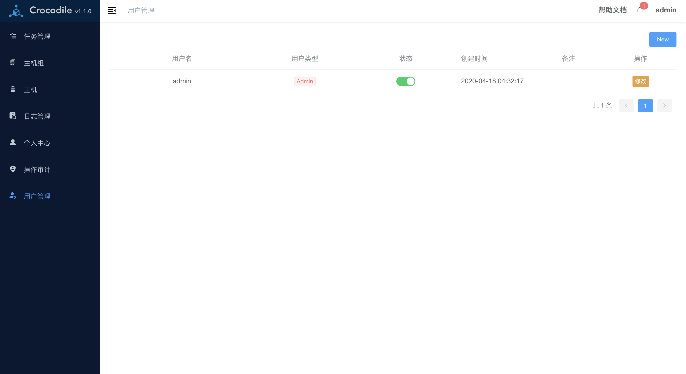
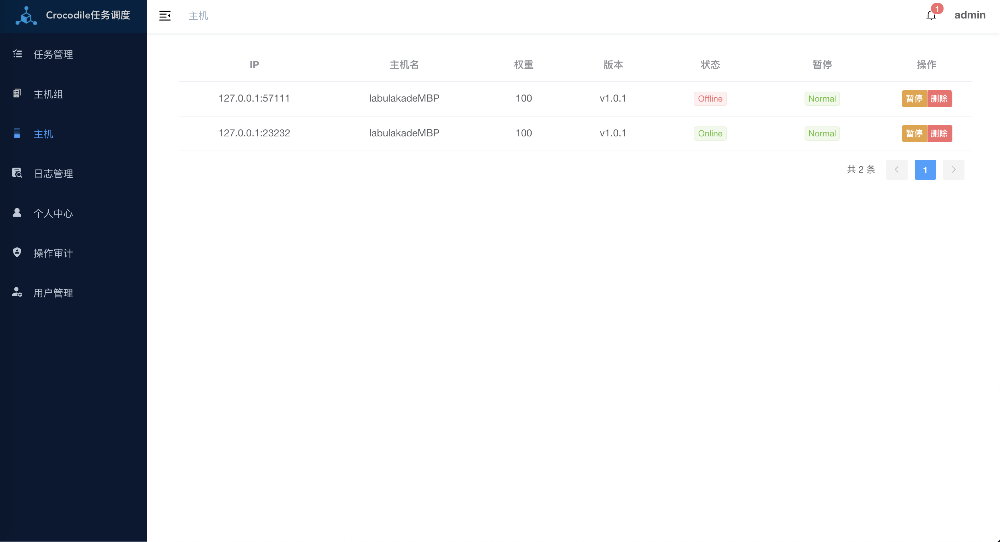
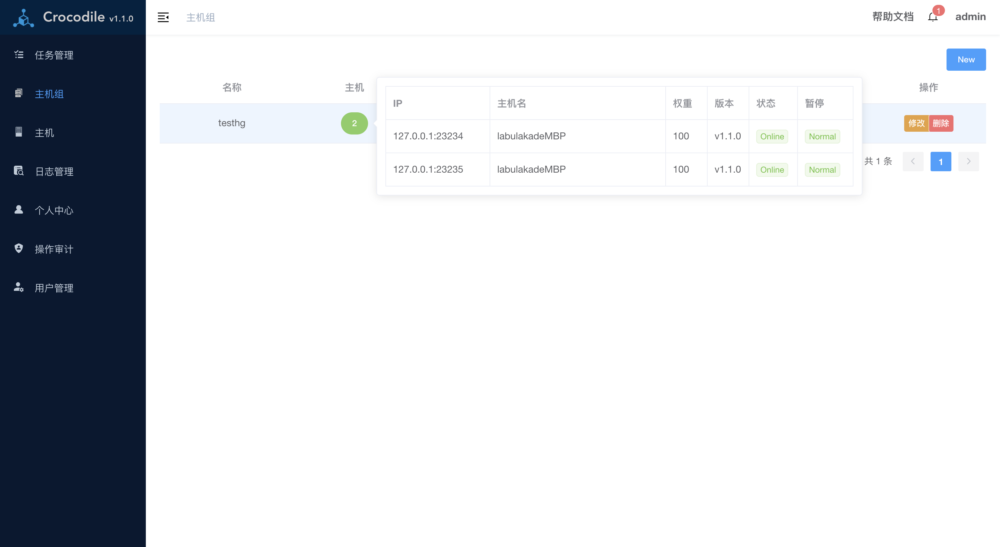

# Crocodile Distributed Task Scheduling System 


[](https://github.com/labulaka521/crocodile/releases)
[](https://github.com/labulaka521/crocodile/blob/master/LICENSE)
[](https://github.com/labulaka521/crocodile/releases)


English | [中文](./README_ZH.md) 

## Introduction
A distributed task scheduling system based on Golang that supports http requests, run golang、python、python3、shell or other scheduled tasks

## Screenshot

<details>
<summary>Click Me</summary>








</details>


```          
                                                  +----------+
        +-------------+                           ||--------||
        ||-----------||                           ||        ||
        ||           ||                           || Worker ||
        ||   调度中心 ||                           ||         ||
        ||           ||      RPC调用(gRPC)        ||---------||
        ||-----------|| +-----------------------> ||-------- ||
        ||-----------||                           ||        ||
        ||           || <-----------------------+ || Worker ||
  +---> ||   调度中心 ||      任务实时日志            ||        ||
任 |    ||           ||                           ||--------||
务 |    ||-----------|| <------+                  ||--------||
完 |     +------------+        |                  ||        ||
成 |         ^    |            |                  || Worker ||
持 |       实|任   |            |数                ||        ||                
久 |       时|务   |获          |据                 +----------+ 
日 |       志|状   |取          |存                
志 |       日|态   |锁          |储
   |        v     v            v
   |      +-------+-+      +----+---+
   |      |         |      |        |
   +----- |  Redis  |      | MySQL  |
          |         |      |        |
          +---------+      +--------+
```

## Features
- Add, modify, delete, clone and run tasks on the web node  
- View real-time logs of running tasks and tasks in real time, and can terminate running tasks  
- Multiple task types:  
    - Perform `http` request tasks  
    - Run `shell`,` python`, `golang`、`python3`、`nodejs`codes (of course other languages ​​can also be supported, please provide if necessary)  
- Father and child tasks:  
    When the parent task or child task is set, the `parent task`->` main task`-> `subtask` will be run first. If any task fails, the entire process will be interrupted immediately. You can also set the parent task or subtask` `Or` serial` run
- Scheduling Algorithm:    
    Supports four scheduling algorithms: random, rotation, worker weight, minimum worker number to call Worker to run tasks,
- Custom alarm strategy:  
    Can be set to alert multiple users when the task `success`,` failure`, or `run is completed`  
    Set the return code or return content of the task to compare whether the actual return code or return content of the task is the same to determine whether the task runs successfully.
- Host group:    
    A task can only be bound to any host group. The running of the task will select a task in this host group to run the task through the task's routing strategy
- Host:  
    A host group can be bound to multiple hosts, the host is the node that actually runs the task, and the dispatch center automatically discovers after registration
- security strategy    
    Certificate encryption encrypts communication data
    Access token
- Task log management, clean up logs  
- Alarm notification support platform  
    - Mail  
    - WeChat  
    - DingDing  
    - Slack Channel  
    - Telegram Bot  
    - WebHook URL  
- Detailed task audit function  
    All operations on data changes to users will be recorded
- Permission control 
    - Administrator  
        Have all operating rights    
    - general user  
        New tasks and host groups can be created, but only tasks or host groups that have been created can be operated, but audit records and all users cannot be viewed    
    - Guest  
    Only viewing authority, no operation modification authority, but can not view audit records, all users


## Supported platforms
- Linux
- Mac

## Quick Start

```
git clone https://github.com/labulaka521/crocodile
cd crocodile
docker-compose up -d
```
Then open url`http://ip:8080`


## Running
- [Click to download](https://github.com/labulaka521/crocodile/releases),uncompress it  
- install`redis`、`mysql`,then change config file `core.toml`
- If you need to enable certificate authentication between scheduling nodes, please generate a certificate,  
    Run the command to generate cert certificate 
    ```
    crocodile cert
    ```
        Then two files `cert.pem` and` key.pem` will be generated locally in the current directory. After saving these two files, fill in the path of the file in the value configuration file. Each node needs these two files  

- Run as a scheduler center   
    Multiple dispatch centers can be started to prevent single points of failure from causing dispatch to hang up    

    ```shell
    ./crocodile server -c core.toml
    ```
- Run as a Worker (host) node    
    ```
    /crocodile client -c core.toml
    ```

- View version compilation information
    ```
    ./crocodile version
    ```
    
- [Configuration Alarm](https://github.com/labulaka521/crocodile/wiki/%E9%85%8D%E7%BD%AE%E6%8A%A5%E8%AD%A6%E9%80%9A%E7%9F%A5)

## Development
- Frontend
    - Install `yarn`  
    - Go to the web directory, first download the dependency `yarn`, and then run the front-end` yarn run dev` separately   
    - Package to go, execute `make frontrnd`,
- Backend  
    - Run `make runs` as a schdeule center
    - Run `make runc` as worker node
> The sql directory is also packaged in `go-bindata`. During installation, the sql creation statement will be read from the file generated by` go-bindata`. If the sql is modified, re-execute `make bin-data`


# TODO
[Crocodile_Trello](https://trello.com/b/9o299bds/crocodile)

## License
Crocodile is under the MIT license. See the [LICENSE](./LICENSE) file for details.