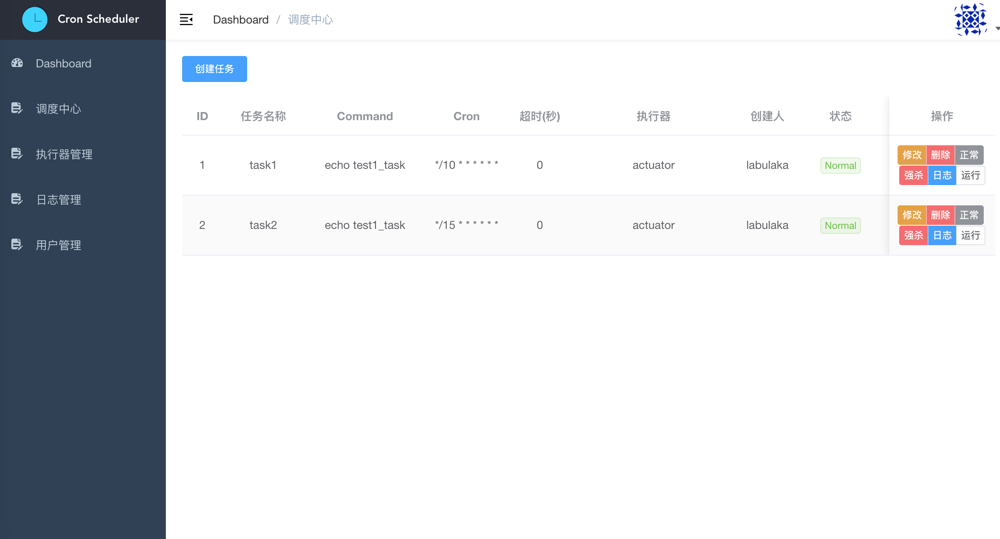
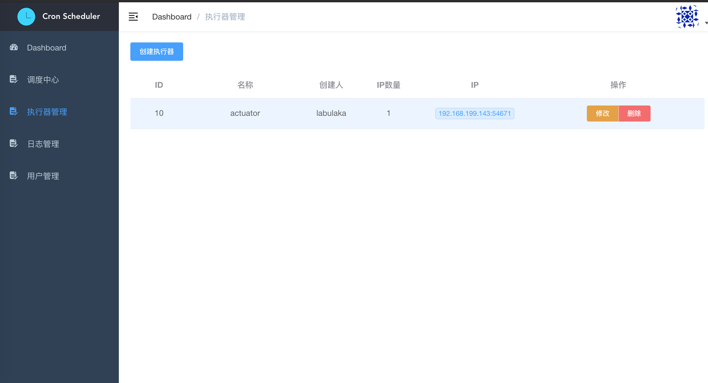
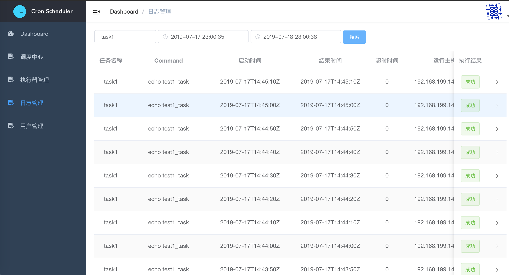
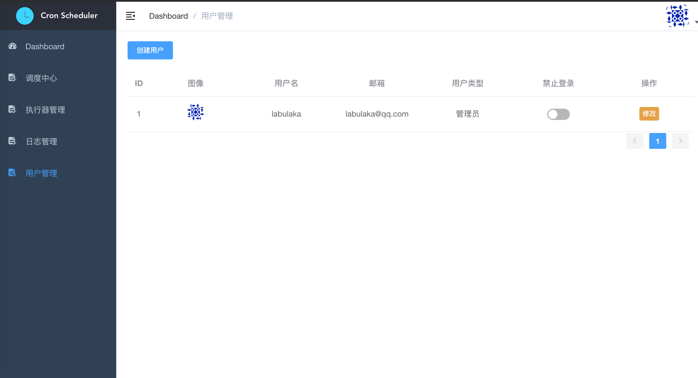

# Crocodile   
基于[go-micro](https://github.com/micro/go-micro)的任务调度系统


# Feature
- 通过web界面方便的对任务进行修改删除增加查看等操作
- 设置任务最大运行时间，超出时间后任务会自动停止返回
- 可以手动触发任务的执行或者对于运行时间较长的任务可以手动停止运行的任务
- 对于任务的执行日志可以在在web页面直接查看，方便的查看任务的执行结果
- 对于一些暂时不需要运行的任务可以在web页面修改其状态为暂停，这个任务就会停止调度运行
- 对于管理员拥有对所有任务执行器的修改操作，普通管理员则只可以对自已创建的任务进行操作
- 每个任务必须绑定一个执行器，可以控制任务在哪些主机上运行
- 任务到期后会通过发布订阅服务发布任务，订阅者会接收到任务后异步执行


## 主目录介绍
  - common  
    公共的包
  - service
    - actuator  
      执行器
    - executor  
      执行任务的服务
    - taskjob  
      任务管理的服务
    - log  
      日志管理的服务
    - user  
      用户管理的服务
  - web
    - job  
    任务,任务日志的接口平台
    - actutor  
    执行器接口
    - user  
    用户管理接口
    
 
## Web界面
[crocodile_web](https://github.com/labulaka521/crocodile_web/tree/permission-control)  
基于[vue-admin-template](https://github.com/PanJiaChen/vue-admin-template)开发






## 启动各个服务
- API网关 
  下载api网关包
  ```
  git clone https://github.com/micro/micro
  ```
  创建`plugins.go`文件,import后面添加一行`_ "github.com/micro/go-plugins/registry/etcdv3"`  
  编译后放入系统的环境变量目录中
  ```
  go build -o micro main.go plugins.go
  ```
  然后在crocodile主目录运行
  ```
  make run_api
  ```
- 数据库  
  安装etcd与mysql  
  - mysql: 存储任务，日志，执行器，用户  
    创建数据库`crocodile`  
    然后将`docs/database.sql`导入数据库 `mysql -u user -h host -p password crocodile < docs/database.sql`  
  - etcd: 用来服务注册发现
- 启动各个服务  
  将`config.yaml`配置文件复制到各个模块，修改配置文件中数据库，配置等信息      
  在各个模块下启动服务  

