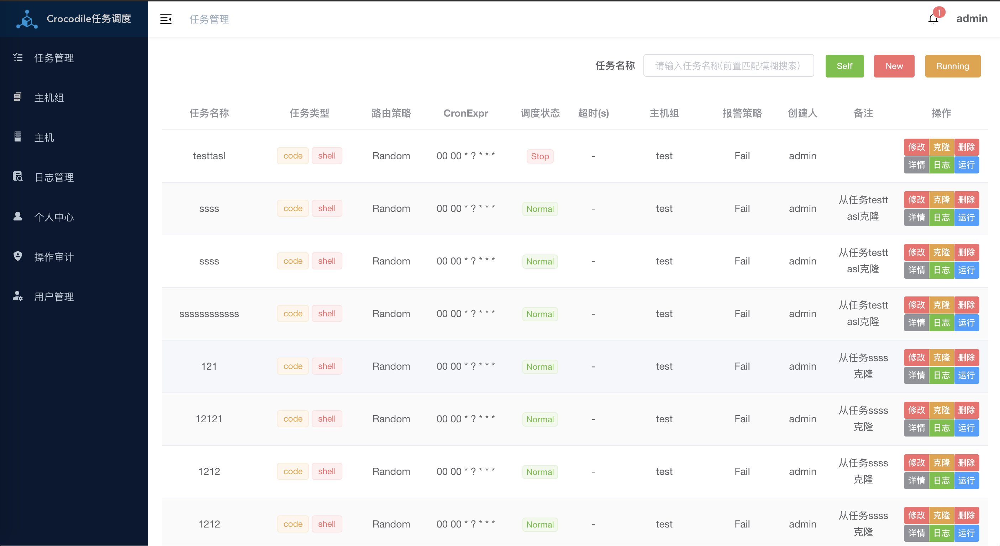
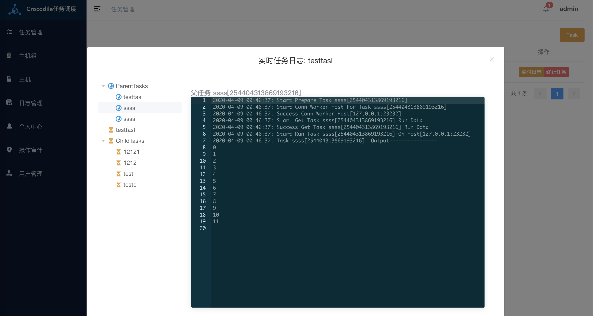
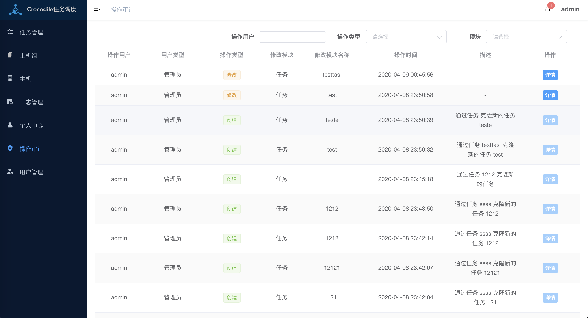
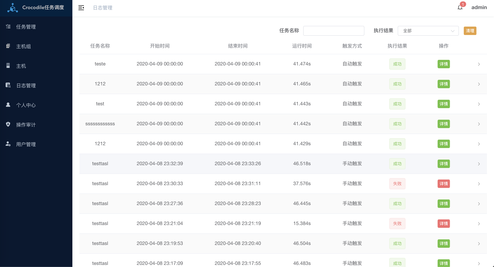

# Crocodile 任务调度系统


[](https://github.com/ouqiang/gocron/releases)
[](https://github.com/labulaka521/crocodile/blob/master/LICENSE)
[](https://github.com/labulaka521/crocodile/releases)


## Introduction
基于Golang开发的定时任务调度系统，支持http请求、运行golang、python、shell等调度任务  

## Online Preview
**[Online Preview](http://crocodile-test.herokuapp.com/crocodile/)** normal/normal


<div align="center">
 
</div>
<div align="center">
 
</div>

## Features
- 在Web节点对任务进行增加、修改、删除、克隆、运行任务等操作
- 实时查看正在运行的任务和任务的实时日志，并且可以对正在运行的任务进行终止操作
- 多种任务类型:
    - 执行`http`请求任务
    - 运行`shell`、`python`、`golang`代码(当然其他语言也可以支持，如需要请提出)
- 父、子任务:   
    当设置了父任务或者子任务后，先会运行`父任务`->`主任务`->`子任务`，任意任务出错后会立即中断整个流程，还可以设置父任务或子任务`并行`或者`串行`运行
- 调度算法:  
    支持四种调度算法随机、轮训、Worker权重、Worker最少任务数来调用Worker运行任务，
- 自定义报警策略:  
    可以设置当任务`成功`、`失败`、或者`运行完成后`报警给多个用户  
    设置任务的返回码或者返回内容来比较任务的实际返回码或者返回内容是否相同来判断任务运行成功或者，code任务默认为0，http任务默认为200  
- 主机组:  
    一个任务只可以绑定到任意一个主机组，任务的运行会通过任务的路由策略来选取这个主机组中的一个任务来运行任务
- 主机:  
    一个主机组可以绑定多个主机，主机是实际运行任务的节点,注册后调度中心自动发现
- 安全策略  
    证书加密加密通讯数据   
    访问令牌
- 任务的日志管理，清理日志
- 报警通知支持平台  
    - 邮件  
    - 企业微信  
    - 钉钉  
    - Slack Channel   
    - Telegram Bot
    - WebHook URL
- 详细的任务审计功能  
    对用户的所有对数据改变的操作都会记录下来
- 权限控制  
    有三种用户类型
    - 管理员  
        拥有所有操作权限，
    - 普通用户
        可以创建新的任务、主机组,但是只可以自已创建的任务或主机组进行操作，但是不能查看审计记录、所有用户
    - 访客  
        只有查看的权限、无任何操作修改权限，但是不能查看审计记录、所有用户


## Supported platforms
- Linux
- Mac

## Install
- [点击下载](https://github.com/labulaka521/crocodile/releases)编译好的二进制文件
- 下载[配置文件](https://raw.githubusercontent.com/labulaka521/crocodile/master/core.toml)
- 如果需要开启调度节点之间的证书认证，请生成证书，
    运行生成cert证书的命令
    ```shell
    crocodile cert
    ```
    然后会在当前目录本地生成两个文件`cert.pem`、`key.pem`，将这两个文件保存后，将文件的路径填写值配置文件中,每个节点都需要这两个文件
- 修改配置文件的配置

## Running
  >调度中心和Worker之间通过对方的IP:PORT都可以正常通信  
  >数据库支持sqlite3或者mysql
- 作为一个调度中心来运行
    ```shell
    ./crocodile server -c core.toml
    ```
- 作为一个Worker(主机)节点来运行
    ```shell
    ./crocodile client -c core.toml
    ```
- 查看版本编译信息
    ```
    ./crocodile version
    ```
- [配置报警](https://github.com/labulaka521/crocodile/wiki/%E9%85%8D%E7%BD%AE%E6%8A%A5%E8%AD%A6%E9%80%9A%E7%9F%A5)

## Development
- 前端
    - 安装`yarn`
    - 进入web目录,先下载依赖`yarn`,然后单独运行前端`yarn run dev`
    - 打包至go，执行`make frontrnd`，
- 后端
    - 作为调度中心运行`make runs`
    - 作为Worker节点运行`make runc`
> sql目录也是被打包在`go-bindata`中的，在安装时会从`go-bindata`生成的文件读取sql创建语句，如果修改了sql，就重新执行下`make bin-data`

## Feedback
请在[Issue](https://github.com/labulaka521/crocodile/issues/new)提出，并且描述清楚上下文

QQ群: **704802230**

# TODO
- [x] 用户管理  
      普通用户、管理员、访客
- [x] 主机组管理
- [x] 主机管理
- [x] rpc调度任务执行
- [x] 调度任务采用tls加密、token认证
- [x] 任务操作[增加、删除、更新、查询、暂停调度]
- [x] 保存执行日志
- [x] 实现两种task Run 接口
- [x] 手动触发任务、终止任务、获取任务日志
- [x] 使用golint检测代码
- [x] 删除主机，暂停主机运行任务
- [x] 运行任务流式返回数据
- [x] 实时在线日志后端接口 
    - 任务执行结果需要流式的返回 
    - 运行任务重写
- [x] 在一个任务中保存父子主任务的状态
- [x] 平滑退出
- [x] 调度算法
    - 随机
    - 最少任务数
    - 权重
    - 轮询执行
- [x] 报警
    - 配置告警模式，任务失败、成功 时报警
    - 通过检测返回结果、状态码，来判断是否报警，默认只检查返回码。
    - 报警方式: 邮箱,钉钉,企业微信,Telegram,Slack,自定义Webhook
- [x] 支持语言`shell`,`golang`,`python`
- [x] Swagger API
- [x] 返回统计总数
- [x] 模糊搜索，查看自已创建的任务
- [x] 任务克隆
- [x] 获取正在运行的任务及实时任务日志(`websocket`)
- [x] 操作审计
- [x] 前端
- [ ] 系统统计图
- [ ] 调度中心集群
- [ ] `Prometheus`+`grafana` 监控
- [ ] ldap支持


## License
Crocodile is under the MIT license. See the [LICENSE](./LICENSE) file for details.
